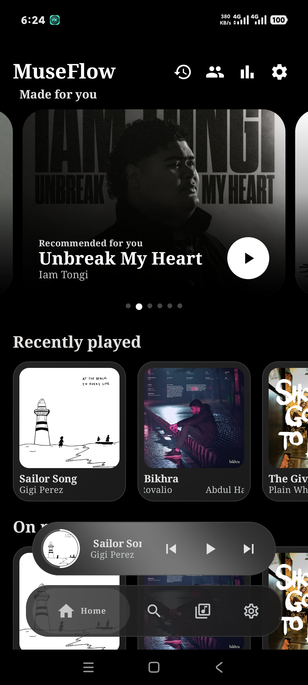
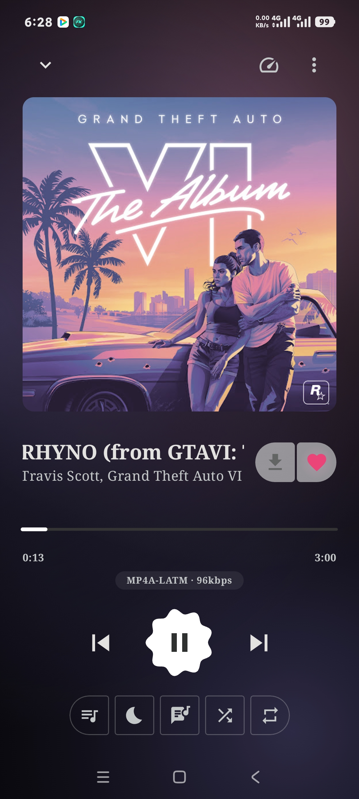
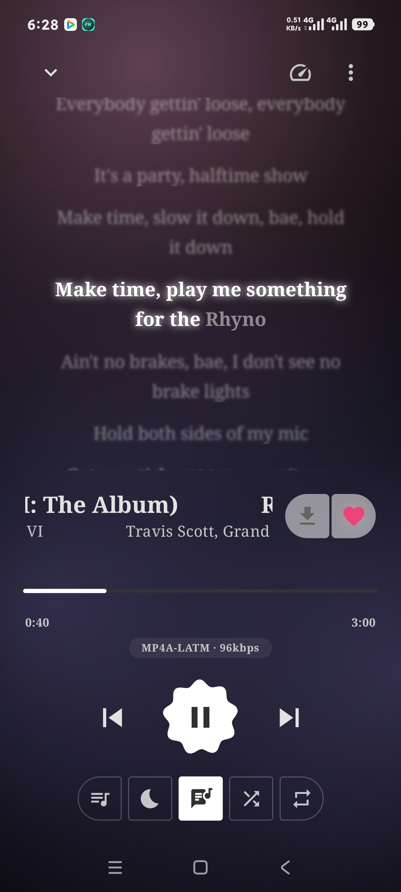
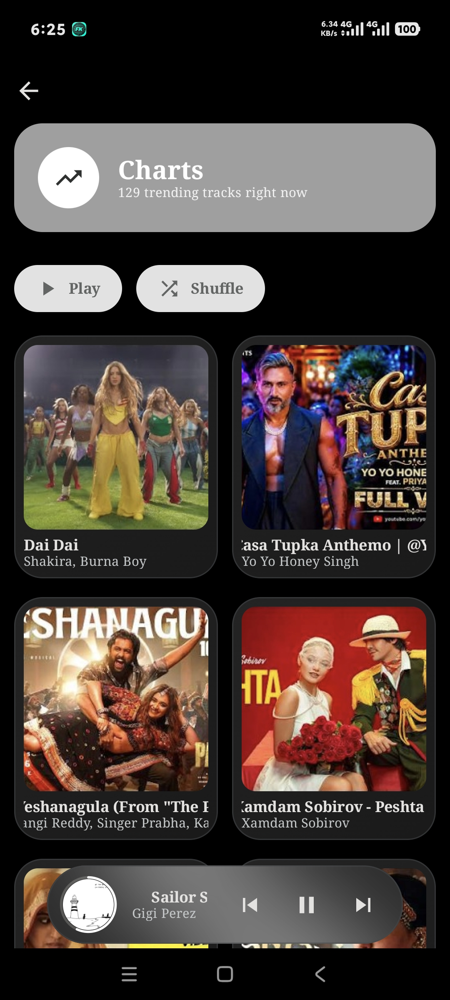
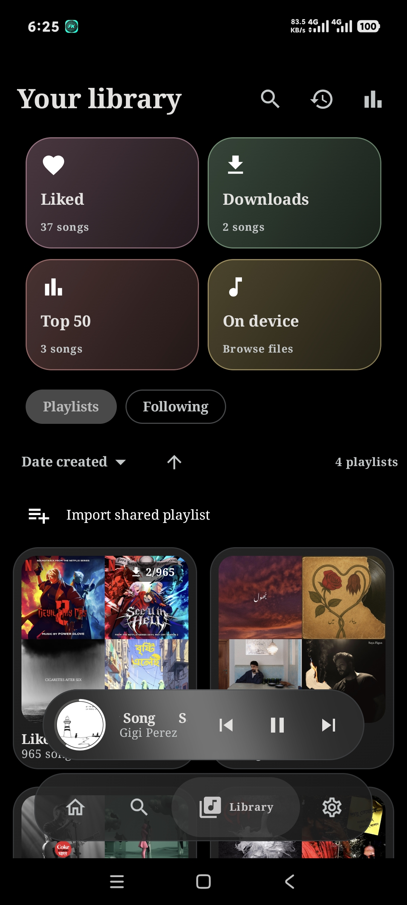

<div align="center">


<h1>MuseFlow</h1>

<p><strong>Music that moves with you.</strong></p>

<p>A free, ad-free Android music player for streaming, downloads, and songs on your device.</p>

<p>
  
  
  
  
</p>

</div>

---

## Overview

MuseFlow brings streaming, offline downloads, local songs, synchronized lyrics, and deep Player customization into one Android app. It is built with Kotlin, Jetpack Compose, and Media3, with a focus on making everyday listening feel personal and easy to control.

> [!NOTE]
> MuseFlow is a personal, actively developed beta. It does not host music or provide an official YouTube service. Online playback relies on unofficial YouTube Music and YouTube interfaces that may change or stop working.

## Contents

- [Screenshots](#screenshots)
- [Features](#features)
- [Installation and setup](#installation-and-setup)
- [How it works](#how-it-works)
- [Roadmap](#roadmap)
- [Credits](#credits)
- [License](#license)

---

## Screenshots

Device screenshots for the current beta will be added here. The gallery is prepared for Home, Library, Lyrics, MuseChart, and two Player views.

<!-- Replace the sentence above with this gallery after adding the named images.
<table>
  <tr>
    <td align="center"><strong>Home</strong><br><br></td>
    <td align="center"><strong>Player</strong><br><br></td>
    <td align="center"><strong>Player 2</strong><br><br></td>
  </tr>
  <tr>
    <td align="center"><strong>Lyrics</strong><br><br></td>
    <td align="center"><strong>MuseChart</strong><br><br></td>
    <td align="center"><strong>Library</strong><br><br></td>
  </tr>
</table>
-->

---

## Features

### New in 1.5.0

> - **Appearance redesign** — Four theme modes, artwork colours, a custom hue picker, and visual choices for fonts, density, and card size.
> - **More expressive Player** — Glow and Apple Music inspired backgrounds, rotating artwork, and refined progress styles.
> - **Clearer navigation** — The selected tab expands to show its name; the Mini player shows progress around its cover art.
> - **Easier settings** — Search for controls, preview changes, and reset Appearance, Player, or Mini player choices.
> - **Polished motion** — Artwork swipes, playback indicators that pause with the music, and support for Android's reduced-motion setting.

Read the [full changelog](CHANGELOG.md) for the release history.

<details>
<summary><strong>Streaming and playback</strong></summary>

- Background playback with a media notification and lock-screen controls, including a Like action.
- Queue, shuffle, repeat, sleep timer, and taste-aware autoplay.
- Seven-band equalizer, normalization, crossfade, bass boost, and crossfeed.
- Optional codec and bitrate display for the active stream.
- Offline downloads, local device audio, and recovery to downloaded tracks when connectivity drops.

</details>

<details>
<summary><strong>Discovery and library</strong></summary>

- Search songs, videos, albums, artists, and playlists, including YouTube uploads outside the YouTube Music catalog.
- Home recommendations, charts, new releases, artist pages, and recent searches.
- Liked Songs, Downloads, Top 50, history, local files, and personal playlists.
- Playlist creation, sharing, online playlist saving, CSV and M3U import, and library backup and restore.
- Listen Together rooms for synchronized playback with a compatible server.

</details>

<details>
<summary><strong>Lyrics</strong></summary>

- Synchronized lyrics with word-by-word highlighting and nine animation styles.
- Six reorderable lyric sources: YouLyPlus, PaxSenix, Better Lyrics, SimpMusic, LRCLib, and Kugou.
- An Apple Music inspired lyrics view with a translucent panel over the artwork backdrop.

</details>

<details>
<summary><strong>Personalization</strong></summary>

- Follow system, Light, Dark, and AMOLED modes with album-art colours or a custom accent hue.
- Visual selectors for fonts, display density, and card size.
- Solid, Album gradient, Blurred artwork, Live mesh, Glow animated, and Apple Music inspired Player backgrounds.
- Default, Slim, Wavy, and Squiggly progress controls, plus artwork and transport-button choices.
- Searchable Settings and live Appearance, Player, and Mini player previews.
- Motion that respects Android's reduced-motion setting.

</details>

---

## Installation and setup

### Android installation

Download an APK from [GitHub Releases](https://github.com/Panduu3163/Muse_Flow/releases) when a build is published. MuseFlow is currently distributed as a beta, not through an app store.

**Already using MuseFlow Beta?** Install a newer **beta APK** over the existing beta app to keep its local data. The regular APK has a different Android app ID and installs as a separate app. An in-app update opens Android's installer; it never installs silently. Back up your library before major updates.

<details>
<summary><strong>Build from source</strong></summary>

<br>

1. Clone the repository and open it in Android Studio with a compatible Android SDK and JDK.
2. Create a local signing key in the repository root. The build expects this file, but it is not committed:

   ```sh
   keytool -genkeypair -keystore debug.keystore -storepass android -alias androiddebugkey -keypass android -keyalg RSA -keysize 2048 -validity 10000 -dname "CN=Android Debug,O=Android,C=US"
   ```

3. Sync the Gradle project and build with `./gradlew assembleDebug` (macOS/Linux) or `.\gradlew.bat assembleDebug` (Windows).

A locally generated key **cannot update an APK signed with MuseFlow's existing beta certificate**. Android requires the same app ID and signing certificate for an in-place update.

</details>

---

## How it works

| Area | Technology |
| --- | --- |
| App and UI | Kotlin, Jetpack Compose, Material 3 |
| Playback | Media3 / ExoPlayer and Android media sessions |
| State and storage | Coroutines, Flow, Room, DataStore |
| Networking and images | OkHttp, Retrofit, Coil |

MuseFlow does not host audio. Online search and playback use an included `:innertube` module, YouTube Music and YouTube client integrations, and [NewPipeExtractor](https://github.com/TeamNewPipe/NewPipeExtractor) where stream signatures need resolving. Local files play through Android's media library without a network request. Lyrics are fetched separately from the audio stream. Because the online integrations are unofficial, availability can vary by track, region, and changes to upstream services.

---

## Roadmap

The current plan runs through **MuseFlow 1.8.0**. A later v2 will be researched separately. Planned areas include a more connected Player and Mini player experience, clearer queue editing, faster discovery and library organization, and deeper accessibility and performance work. See the [version roadmap](docs/MUSEFLOW-1.5-1.8-AND-V2-ROADMAP.md) for the proposed scope; planned items are not promises of shipped features.

---

## Credits

MuseFlow builds on work and ideas shared by the open-source music community:

- [Metrolist](https://github.com/MetrolistGroup/Metrolist) and [SimpMusic](https://github.com/maxrave-dev/SimpMusic) for YouTube Music integration research.
- [NewPipeExtractor](https://github.com/TeamNewPipe/NewPipeExtractor) and [zemer-cipher](https://github.com/ZemerTeam/zemer-cipher) for stream and cipher work.
- [Echo Music](https://github.com/EchoMusicApp/Echo-Music) for Player, lyrics, and Listen Together references. Some component and protocol ideas were adapted under the project's open-source license.
- The maintainers of LRCLib, Better Lyrics, YouLyPlus, PaxSenix, SimpMusic, and Kugou for lyric sources.

See the source and bundled license notices for implementation details and attribution.

---

## License

MuseFlow is licensed under [GPL-3.0](LICENSE).

## Developer

**Mynul Kabir Nayem** · mynulkbr@gmail.com

<div align="center">

*Made with care for the music and the people listening.*

</div>
